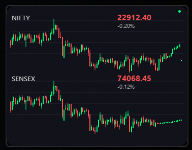

# SensexNiftyWidget

SensexNiftyWidget is a lightweight Windows desktop application that displays real-time-like intraday charts for the NIFTY and SENSEX indices directly on your desktop.

The application is built using Python and the Qt framework (PySide6), with a custom rendering pipeline for drawing candlestick charts instead of relying on external charting libraries.

It runs as a frameless desktop widget, stays behind active windows, and integrates with the system tray for unobtrusive usage.

---

## Screenshot

---

## Features

- Real-time-like intraday charts for NIFTY and SENSEX  
- Custom candlestick chart rendering (no external chart libraries)  
- Automatic data refresh every 10 seconds  
- Interactive controls:
  - Zoom (mouse wheel)
  - Pan (drag)
  - Crosshair with OHLC data  
- Visual feedback for price changes (color transitions and highlights)  
- Frameless desktop widget that stays behind active windows  
- System tray integration (show / hide / exit)

---

## Tech Stack

- Python  
- PySide6 (Qt for Python)  
- QPainter (custom rendering engine)  
- Requests (HTTP API calls)  
- PyInstaller (build executable)  
- Inno Setup (installer creation)

---

## Skills Demonstrated

- Desktop application development  
- GUI programming with Qt  
- Custom graphics rendering (candlestick charts)  
- Real-time data handling and UI updates  
- Event-driven programming (mouse interaction, timers)  
- Windows-specific behavior (window layering, system tray)  
- Software packaging and distribution  
- Performance optimization for smooth rendering  

---

## How It Works

- Fetches stock data from Yahoo Finance API  
- Parses OHLC (Open, High, Low, Close) data  
- Maps price values to screen coordinates  
- Renders candlestick charts using QPainter  
- Updates UI continuously using timers  
- Handles user interactions like zoom, pan, and hover  

---

## Step-by-Step Development Process

### 1. Defining the Goal
- Build a lightweight desktop widget for stock monitoring  
- Must run as standalone `.exe`  
- Should not rely on browser or heavy frameworks  

---

### 2. Choosing the Tech Stack
- GUI: PySide6 (Qt)  
- Data: Yahoo Finance API  
- Rendering: Custom QPainter-based engine  
- Packaging: PyInstaller  
- Installer: Inno Setup  

---

### 3. Setting Up the Window
- Created frameless QWidget  
- Applied window flags for widget-like behavior  
- Positioned window manually on screen  

---

### 4. Fetching Stock Data
- Called Yahoo Finance API using requests  
- Parsed JSON response  
- Extracted timestamps and OHLC values  
- Filtered invalid data  

---

### 5. Designing Data Structures
- Stored raw data separately from display data  
- Applied smoothing/interpolation for animations  

---

### 6. Implementing Rendering Engine
- Used QPainter for drawing  
- Mapped price → screen coordinates  
- Rendered:
  - grid lines  
  - candlestick wicks  
  - candlestick bodies  

---

### 7. Adding Real-Time Updates
- Used QTimer for:
  - periodic data fetch (10 seconds)  
  - continuous UI refresh (~30 FPS)  

---

### 8. Implementing Interaction
- Zoom via mouse wheel  
- Pan via dragging  
- Crosshair with OHLC tooltip  

---

### 9. Visual Feedback Enhancements
- Price change detection  
- Color-based highlights (green/red)  
- Pulse indicator for live updates  

---

### 10. Fixing UI Rendering Issues
- Fixed edge artifacts using adjusted drawing rectangle  
- Applied anti-aliasing and rounded corners  

---

### 11. Desktop Integration
- Used WindowStaysOnBottomHint  
- Ensured widget stays behind apps  
- Avoided unstable system hacks  

---

### 12. System Tray Integration
- Added tray icon and context menu  
- Implemented show/hide/exit  
- Overrode close behavior to hide app  

---

### 13. Performance Optimization
- Limited number of candles rendered  
- Used interpolation instead of full redraw  
- Maintained smooth rendering  

---

### 14. Packaging into Executable
- Used PyInstaller:
- pyinstaller --onefile --noconsole --icon=icon.ico main.py

---

### 15. Creating Installer
- Used Inno Setup  
- Configured app metadata, shortcuts, and install flow  
- Generated Setup.exe  

---

### 16. Distribution
- Uploaded code to GitHub  
- Distributed installer via GitHub Releases  

---

### 17. Validation
- Compared output with Google Finance / trading platforms  
- Verified correctness (with slight delay)  

---

## Installation

### Option 1 — Installer (Recommended)

1. Download from Releases  
2. Run: SensexNiftyWidgetSetup.exe
3. Install and launch  

---

### Option 2 — Run from Source
- pip install PySide6 requests
- python main.py

---

## Data Disclaimer

- Data is fetched from Yahoo Finance (unofficial API)  
- Prices are real but may be slightly delayed (~15–60 seconds)  
- Not intended for trading decisions  

---

## Future Improvements

- Support for multiple stocks  
- Technical indicators (EMA, RSI)  
- Real-time streaming via trading APIs  
- Settings panel and customization  

---

## Author

Vibhav  
Publisher: thewitness

